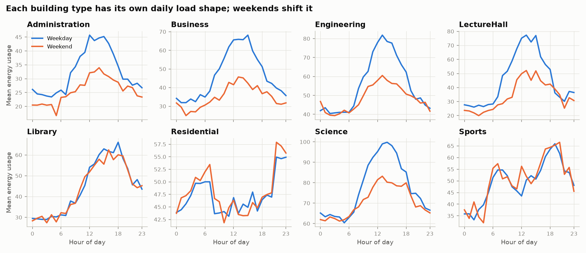
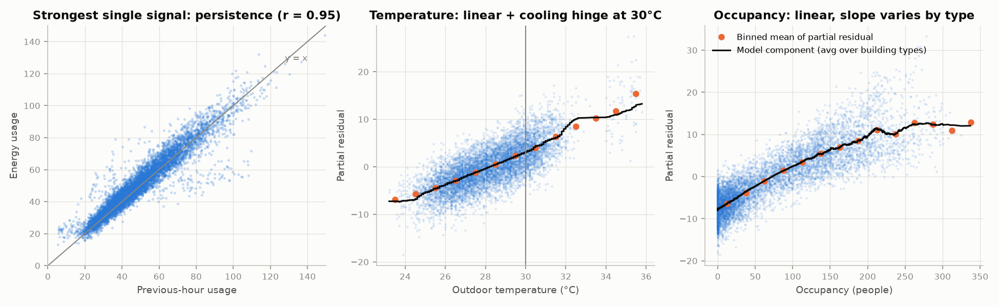
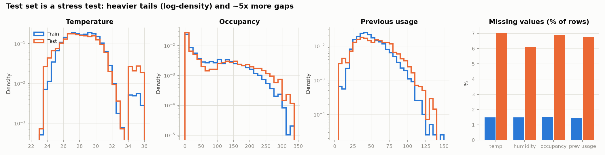
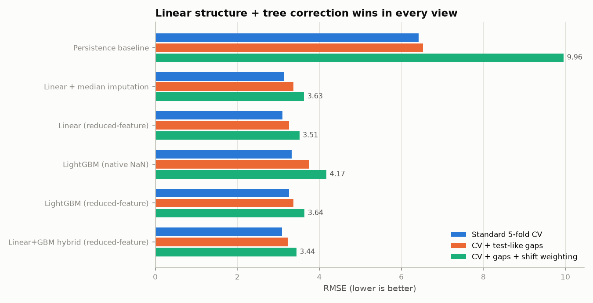
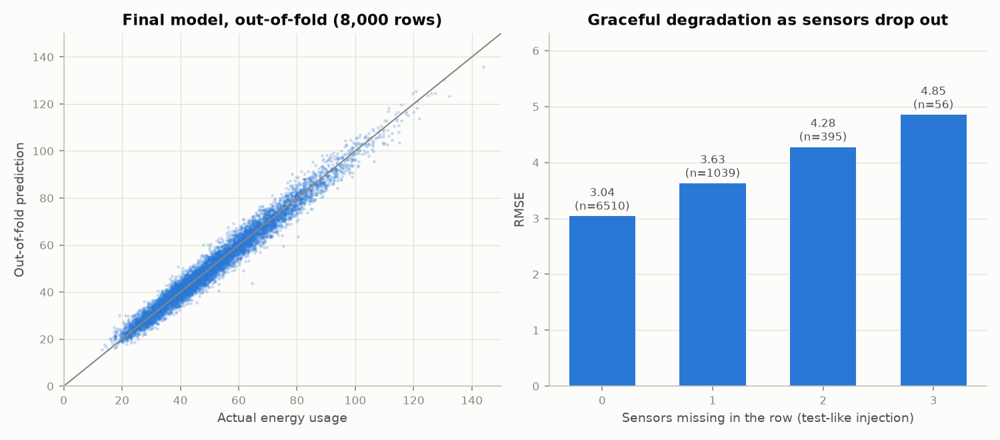
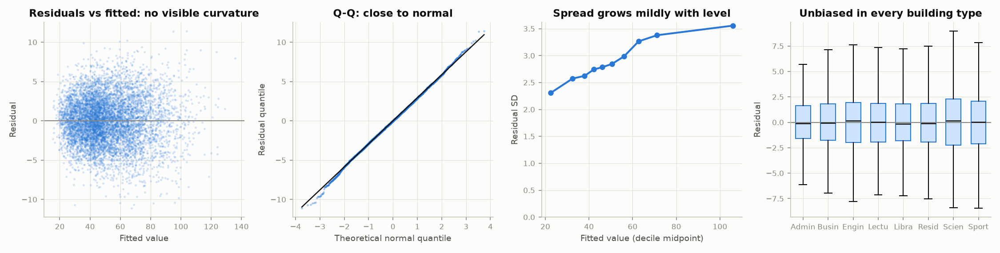

# Predicting Campus Building Energy Usage: Track 1 Report

## TL;DR

| | |
|---|---|
| **Task** | Predict `energy_usage` for one building-hour from building, calendar, weather, occupancy and previous-hour usage |
| **Final model** | **Structured linear regression + a shallow LightGBM residual correction**, fitted **once per pattern of missing sensors** ("reduced-feature" models) |
| **Cross-validated score** (5-fold × 3 repeats, 8,000 rows) | **RMSE 3.09 · MAE 2.44 · R² 0.972** |
| **Test-like score** (CV with the test set's missing-value patterns injected and its covariate shift re-weighted) | **RMSE 3.44 · MAE 2.61 · R² 0.972** |
| **Naive baseline** (this hour = previous hour) | RMSE 6.42 · MAE 4.34 · R² 0.879 |
| **Submission** | `outputs/submission.csv`: 3,000 rows, `id,energy_usage` |

Three findings drive every design decision:

1. **Energy use is additive and mostly linear.** It is a building-specific daily schedule plus linear effects of occupancy, temperature and previous-hour usage. A well-specified linear model beats gradient-boosted trees (CV RMSE 3.10 vs 3.33).
2. **The test set is harder than the training set.** It has about 5× more missing sensor values (18% of rows vs 6%) and many more extreme rows: heat-wave hours (34–36 °C), packed rooms and unusual previous-hour usage. A classifier can tell train rows from test rows with AUC 0.68.
3. **The linear relationships hold in those extremes** (slopes are unchanged in the tails), so a model with a correct linear structure extrapolates there more reliably than trees, which are piecewise-constant and have few training points in the tails.

---

## 1. Understanding the problem

A university campus wants to know how much energy each building will use in a given hour. Accurate predictions support:
- HVAC and chiller scheduling
- demand-peak management
- budgeting
- spotting anomalies, such as a building using far more than predicted

The data has one row per **building-hour snapshot**:

| Column | Meaning | Notes |
|---|---|---|
| `building_id` | 12 buildings (`ADM_A`, `BUS_A`, `BUS_B`, `ENG_A`, `ENG_B`, `LEC_A`, `LIB_A`, `RES_A`, `RES_B`, `SCI_A`, `SCI_B`, `SPT_A`) | Never missing |
| `building_type` | 8 types (each building belongs to exactly one) | Never missing |
| `hour`, `day_of_week`, `month` | Calendar | Never missing |
| `temperature`, `humidity` | Outdoor weather (°C, %) | ~1.5% missing in train, ~6–7% in test |
| `occupancy` | People in the building | ~1.5% / ~7% missing |
| `previous_usage` | Energy used in the previous hour | ~1.4% / ~7% missing |
| `energy_usage` | **Target** (train only), mean 51.2, SD 18.4 | |

**What the metrics reward.**
- **RMSE** squares the errors, so a few large misses (typically in unusual rows) dominate it.
- **MAE** measures the typical miss.
- **R²** is the share of variance explained.

A good model therefore needs to be accurate on ordinary hours *and* avoid large misses on unusual ones. Section 2.5 shows the test set has many more unusual rows than the training set.

**What the problem is not.** It is not a time-series problem in practice. IDs are not in time order: month and hour are uniform across ID ranges, and a building's `previous_usage` correlates only 0.47 with the usage in its preceding-ID row. Each row is an independent snapshot that happens to carry a lag feature. That makes **shuffled K-fold cross-validation the right validation scheme**, with no look-ahead leakage to worry about.

---

## 2. What the data says

### 2.1 Each building type has its own daily load shape



- Offices, business, lecture and science buildings peak around midday on weekdays and drop at weekends.
- The library peaks in the early evening.
- Sports peaks in the early morning and evening.
- Residential halls are highest at night and dip during class hours.

**Building, hour, weekend and month alone explain 86% of the variance** (CV R² 0.858). Section 3 builds the core model on this structure.

### 2.2 The drivers act additively and (almost) linearly



Each panel plots usage against one driver after removing everything else the model explains (a partial-residual plot).

- **`previous_usage`** is the strongest single signal (r = 0.95 with the target). Once the schedule is known, though, it mainly carries the *unexplained* part of the current state, such as an event or a fault, so its coefficient is about 0.34, not 1.
- **Occupancy** is linear. The slope depends on the building type: a lecture hall adds about 0.13 units per person, a residence hall 0.045, because residents' load is mostly fixed.
- **Temperature** is linear (about 1.1–2.4 units per °C depending on type) **plus a cooling "hinge"**: above 30 °C chillers work disproportionately hard, adding a further 0.43 units per °C. The hinge location was chosen by CV against 31, 32 and 33 °C, an extra heating hinge below 25 °C, and a quadratic. The quadratic scored the same to within 0.002 RMSE; the hinge was kept because it has a physical meaning (cooling degree-days).
- **Humidity** adds almost nothing once temperature is known.
- **The effects add rather than multiply.** A log-target (multiplicative) version of the same model is far worse (test-like RMSE 4.37 vs 3.51).

What each block of drivers contributes (5-fold CV on complete rows, linear model):

| Inputs | RMSE | MAE | R² |
|---|---|---|---|
| Building + type × hour + weekend + month | 6.96 | 5.05 | 0.858 |
| + occupancy (type-specific slope) | 4.92 | 3.73 | 0.929 |
| + temperature (type slope + cooling hinge) | 4.00 | 3.04 | 0.953 |
| + humidity | 3.99 | 3.03 | 0.953 |
| + previous-hour usage | **3.02** | **2.40** | **0.973** |

### 2.3 The remaining error looks like irreducible noise

Every extra interaction I tried changed CV RMSE by less than 0.01 or made it worse through overfitting:
- per-building rather than per-type hourly profiles
- hour × weekend × type
- type × month
- temperature × hour
- type-specific `previous_usage` slopes
- squared occupancy

The linear model's residual SD is 2.98, so an RMSE of about 3 is close to the noise floor of this data.

### 2.4 Missing values are random

Missing-ness cannot be predicted from building, time or even the target: logistic-regression AUC is 0.495, and a Welch t-test of usage in gappy vs complete rows gives p = 0.59. This supports **missing completely at random (MCAR)**. It means a row with a gap is not systematically different; we simply know less about it.

### 2.5 The test set is a stress test



| | Train | Test |
|---|---|---|
| Rows with ≥1 missing sensor | 5.8% | **18.2%** |
| Rows with ≥2 missing sensors | 0.1% | **7.7%** |
| Heat-wave hours (> 33 °C) | 0.9% | **4.4%** |
| Cold hours (< 24.5 °C) | 0.9% | **3.3%** |
| Occupancy > 250 | 1.7% | **4.5%** |
| `previous_usage` > 100 | 1.3% | **3.0%** |

- **Value ranges are the same** (temperature tops out at 35.8 °C in both). Only the *density* in the tails differs.
- **`previous_usage` and occupancy deviate more from their usual values in test.** Their deviation from what building, hour and weather predict has SD 12.6 vs 7.4 for `previous_usage`, and 52 vs 31 for occupancy.
- **A LightGBM classifier separates train from test with AUC 0.68.** This is classic **covariate shift**: p(x) changes, and we assume p(y | x) does not (checked in section 5).

**Consequence:** a model that is only good on "typical" training rows will under-perform on the test set. It needs to:
- handle missing values well, especially two or three missing at once;
- behave correctly in sparse, extreme regions.

---

## 3. Validation designed to look like the test set

Ordinary CV would over-state test performance, because training rows are cleaner and more typical than test rows. Every candidate was therefore scored three ways, on the same folds (5-fold × 3 repeats, stratified on the target):

1. **Standard CV.** Out-of-fold predictions on the rows as they are.
2. **CV + test-like gaps.** Before predicting a validation fold, its rows are given missing-value patterns drawn from the test set's exact distribution of 15 patterns. That brings 18.2% of rows to at least one gap, matching the test.
3. **Test-like.** View 2, plus each row weighted by the density ratio w(x) = p(test | x) / p(train | x). The ratio comes from an out-of-fold train-vs-test LightGBM classifier, clipped at the 99th percentile. The weighted training rows reproduce the test tails closely:

| | Train | Train, re-weighted | Test |
|---|---|---|---|
| Temperature > 33 °C | 0.92% | 4.28% | 4.37% |
| Occupancy > 250 | 1.74% | 4.33% | 4.47% |
| `previous_usage` > 100 | 1.30% | 2.99% | 3.00% |
| Temperature < 24.5 °C | 0.94% | 2.85% | 3.30% |

View 3 is the closest available proxy for the hidden test score, and it drove the model selection.

---

## 4. Model choice: what was tried and why the final model wins



| Model | CV RMSE | CV MAE | CV R² | +gaps RMSE | **Test-like RMSE** | Test-like MAE | Test-like R² |
|---|---|---|---|---|---|---|---|
| Persistence baseline (`previous_usage`) | 6.423 | 4.342 | 0.879 | 6.524 | 9.959 | 6.332 | 0.767 |
| Linear + building×hour median imputation | 3.138 | 2.455 | 0.971 | 3.373 | 3.628 | 2.689 | 0.969 |
| Linear, reduced-feature | 3.098 | 2.438 | 0.972 | 3.257 | 3.514 | 2.645 | 0.971 |
| LightGBM, native NaN handling | 3.327 | 2.596 | 0.968 | 3.752 | 4.173 | 3.006 | 0.959 |
| LightGBM, reduced-feature | 3.263 | 2.566 | 0.969 | 3.373 | 3.641 | 2.778 | 0.969 |
| **Linear + LightGBM residual, reduced-feature (final)** | **3.090** | **2.435** | **0.972** | **3.224** | **3.441** | **2.609** | **0.972** |

(`outputs/cv_results.csv`, produced by `python -m src.run_cv`.)

### 4.1 The core: a structured linear regression

```
energy = building offset
       + building-type × hour-of-day profile      (8 × 23 terms)
       + building-type × weekend shift            (8)
       + month effect                             (11)
       + building-type × temperature slope        (8)
       + cooling-degree hinge  max(0, T − 30 °C)  (1)
       + humidity                                 (1)
       + building-type × occupancy slope          (8)
       + previous-hour usage                      (1)
       + error
```

That is 234 coefficients, fitted by least squares with a tiny ridge penalty (α = 1) for numerical stability. Continuous inputs are centred.

**Why linear?**
- **It matches the data.** Section 2.2 shows the drivers are additive and linear, apart from the cooling hinge, which is encoded explicitly.
- **It extrapolates safely into the test set's tails.** The slopes are measured to be stable in extreme rows (section 5). Trees, by contrast, predict a flat constant beyond the densest region of the training data.
- **Its variance is low.** About 234 parameters on 8,000 rows; it beats LightGBM on every view.
- **It is interpretable.** Every coefficient has a physical reading (section 7), which matters for facility managers.

### 4.2 The correction: a shallow LightGBM on the linear model's residuals

The linear model is not perfect. The Ramsey RESET test rejects pure linearity (F = 15.8, p < 0.001), and its errors carry small biases in the sparse tails. A LightGBM model is therefore trained on the linear model's residuals:
- **Small trees:** 7 leaves, ≥ 80 rows per leaf, L2 penalty 5, learning rate 0.01, 900 trees. Settings were chosen from a small grid; all of them were within 0.02 RMSE of each other on standard CV.
- **Cross-fitted training residuals:** each training row's residual comes from a linear model that did not see that row, so the trees learn from honest, out-of-sample errors rather than in-sample fit.

The correction removes the remaining tail biases (out-of-fold mean error):

| Slice | Linear only | Linear + trees |
|---|---|---|
| `previous_usage` > 100 | +0.65 | +0.04 |
| Temperature 20–25 °C | +0.43 | +0.02 |
| Temperature 31–32 °C | +0.43 | +0.12 |
| Administration buildings | −0.17 | +0.07 |

These are exactly the regions the test set over-represents. The correction lowers test-like RMSE from 3.51 to 3.44 while leaving ordinary CV slightly better as well (3.098 → 3.090).

### 4.3 Handling missing values: one model per missing pattern

For a row with occupancy missing, the model that predicts it was trained on all 8,000 training rows **without occupancy as an input**. The test set contains 15 different missing patterns, so 15 sub-models are fitted; each is cached and trained on every row that has the sensors it needs.

**Why this beats imputation:**
- **It is the right target.** We want E[usage | what we actually observed]. A reduced-feature model estimates that directly.
- **Imputation fills in a guess and then treats it as a real measurement.** The model then trusts the filled value with the full weight of a real reading, which is wrong when the guess is poor.
- **The evidence agrees.** Reduced-feature beats building×hour median imputation (test-like 3.51 vs 3.63). For LightGBM it beats native NaN handling by a wide margin (3.64 vs 4.17), because the trees saw only about 120 training rows with each sensor missing and never learned what to do with two missing at once.
- **The other sensors partly compensate.** Occupancy, `previous_usage` and temperature are 72–81% predictable from building and time, so the sub-models re-weight what remains.

Error grows gradually as sensors drop out (test-like injection, out-of-fold):



| Sensors missing | Rows | RMSE | MAE | R² |
|---|---|---|---|---|
| 0 | 6,510 | 3.04 | 2.41 | 0.973 |
| 1 | 1,039 | 3.63 | 2.76 | 0.960 |
| 2 | 395 | 4.28 | 3.24 | 0.951 |
| 3 | 56 | 4.85 | 3.68 | 0.922 |

### 4.4 Things that were tried and rejected

| Idea | Result | Why rejected |
|---|---|---|
| Log-target (multiplicative) linear model | Test-like RMSE 4.37 vs 3.46* | The effects add rather than multiply |
| Importance-weighted training (weights from section 3) | Test-like 3.45 vs 3.46*, CV worse (3.14 vs 3.10) | No real gain; more variance |
| Stronger ridge (α = 10) | Test-like 3.63 vs 3.46*, worse on all views | The model is not over-fitting |
| Richer interactions (section 2.3) | No gain or worse | Over-fitting |
| LightGBM alone | CV 3.33 (native NaN) / 3.26 (reduced-feature); a default 31-leaf configuration scored 3.46 | Misses the clean linear structure; weak in sparse tails |

\* From a 2-repeat run of the linear reduced-feature model; the 3-repeat table above has a different third injection seed, which is why its test-like figure is 3.51.

---

## 5. Model assumptions and how each was checked

Diagnostics are computed by `python -m src.diagnostics`, using the full linear model on complete training rows (n = 7,537, 234 parameters, in-sample adjusted R² 0.974). Results are in `outputs/assumption_tests.csv`.



### Linear core (ordinary least squares)

| # | Assumption | How it was checked | Result | Consequence / mitigation |
|---|---|---|---|---|
| 1 | **Linearity and additivity** of the drivers | Partial-residual plots (fig. 2); log vs additive model; Ramsey RESET | Plots linear apart from the cooling hinge, which is modelled; additive form clearly beats multiplicative. **RESET F = 15.8, p < 0.001**: some non-linearity remains | **Partly violated → the reason for the tree correction (4.2)**, which removes the remaining tail biases |
| 2 | **Independent errors** | Durbin-Watson on rows in ID order; check whether IDs are time-ordered | DW = 2.01; IDs are not time-ordered | Holds. Shuffled K-fold is valid |
| 3 | **Constant error variance** (homoscedasticity) | Breusch-Pagan; residual SD by fitted decile | **Violated mildly**: BP p ≈ 1e-13; residual SD grows from 2.3 (low-usage rows) to 3.6 (high-usage rows), ratio 1.54 | OLS predictions stay unbiased, so the main cost is less efficient estimates. Coefficient inference uses **HC3 robust standard errors**. The obvious fix, a log target, was tested and is much worse (test-like 4.37) |
| 4 | **Normal errors** | Q-Q plot; skew/kurtosis; Jarque-Bera | Skew −0.01, kurtosis 3.19 (normal = 3). JB p = 0.003 only because n is large | Close enough. Normality is needed only for small-sample intervals, not for point predictions |
| 5 | **No severe multicollinearity** | VIF of continuous drivers | Temperature 6.3 (overlaps with hour and the hinge), `previous_usage` 5.0, occupancy 3.7, humidity 1.7, hinge 2.2 | Moderate at most. Predictions are unaffected; individual temperature coefficients should be read together with the hinge. The design matrix is full rank by construction |
| 6 | **No dominating influential points** | Cook's distance | Max D = 0.003 (concern threshold ~1) | Holds |
| 7 | **Exogeneity: inputs not driven by the error** | Reasoning | `previous_usage` is measured before the target hour; occupancy and weather are not caused by energy use | Holds for prediction. Coefficients are **predictive associations**, not guaranteed causal effects, because `previous_usage` absorbs unobserved factors |

### Missing-data handling

| Assumption | Check | Result |
|---|---|---|
| Gaps are random given what we observe (MCAR, or more weakly MAR) | AUC predicting gaps from building/time/usage; t-test of usage in gappy vs complete rows | AUC 0.495, p = 0.59: **holds**. Reduced-feature models are then unbiased for E[usage \| observed] |
| The test gaps come from the same mechanism, only more often | Gap rates by building and hour in test are flat (16–22% everywhere) | Consistent. We cannot test it against labels |

### Generalising from train to test (covariate shift)

The key assumption is that **p(usage | inputs) is the same in train and test, and only the mix of inputs differs.** We cannot verify it against the hidden test labels, but we can check that the relationships are stable in the extreme training rows, which is where the test set puts more weight (`outputs/slope_stability.csv`):

| Driver | Rows | n | Slope (usage per unit deviation) | SE |
|---|---|---|---|---|
| `previous_usage` | Normal (\|deviation\| ≤ 12) | 6,609 | 0.351 | 0.008 |
| `previous_usage` | **Extreme** (\|deviation\| > 12) | 928 | 0.369 | 0.007 |
| Occupancy | Normal (\|deviation\| ≤ 60) | 7,182 | 0.0952 | 0.0018 |
| Occupancy | **Extreme** (\|deviation\| > 60) | 355 | 0.0950 | 0.0035 |

The slopes are effectively identical, so the linear core should extrapolate correctly into the test set's heavier tails. Temperature is the one driver that changes behaviour at the extreme; that is exactly what the cooling hinge models.

### Tree component (LightGBM on residuals)

- **No distributional assumptions.** Trees assume only that rows are i.i.d. and that train and test share the same p(y | x).
- **Trees cannot extrapolate.** Beyond the training data they predict a constant. This is acceptable here because the test value ranges match training (the test is denser in the tails, not wider), and the trees only nudge the linear model's predictions rather than carry them.
- **Over-fitting is controlled** with shallow trees, large leaves, an L2 penalty, a slow learning rate and cross-fitted residuals.

---

## 6. Final results

| Evaluation view | RMSE | MAE | R² |
|---|---|---|---|
| 5-fold CV × 3 repeats (8,000 rows) | **3.090** | **2.435** | **0.9719** |
| CV with test-like missing values | 3.224 | 2.508 | 0.9695 |
| CV with test-like missing values + shift weighting | 3.441 | 2.609 | 0.9722 |

**Expected test performance: RMSE ≈ 3.2–3.5, MAE ≈ 2.5–2.6, R² ≈ 0.97.** That is roughly half the error of the naive persistence forecast, and close to the data's noise floor (residual SD ≈ 3.0).

The submission (`outputs/submission.csv`) passes its checks:
- 3,000 rows in the same order as the test file, with no missing values
- predictions range from 13.7 to 133.1
- per-building means line up with each building's typical level

---

## 7. What the model tells facility managers

From the linear core, with HC3 robust 95% CIs (`outputs/linear_coefficients.csv`):

- **Science buildings are the heavy hitters and the most weather-sensitive.**
  - At the overnight baseline (hour 0, same weather and occupancy), about +28 to +32 units above the Administration building.
  - **+2.38 units per °C**, about twice a residence hall's +1.10.
  - These are the best targets for chiller and HVAC efficiency work.
- **Above 30 °C every building pays an extra +0.43 units per °C** (CI 0.23–0.62), the cooling penalty. A heat-wave afternoon at 35 °C costs about +2 units per building on top of the linear effect. Heat-wave forecasts should trigger pre-cooling.
- **Occupancy matters most in lecture halls (+0.134 per person) and least in residences (+0.045).** In residences the load is mostly baseline (fridges, hot water, lighting), not per-person.
- **Weekends save energy beyond lower occupancy only in Business (−3.2), Lecture halls (−2.7) and Administration (−2.1).** In Engineering and Science the weekend drop is fully explained by fewer people (weekend terms ≈ 0, p > 0.2). That suggests their equipment and HVAC baseline does not step down at weekends, which is worth checking as a schedule-tuning opportunity.
- **Seasonality is mild and smooth.** It runs from +1.1 in April to −1.1 in October relative to January, consistent with an academic-calendar effect.
- **Persistence: each extra unit of last hour's usage, beyond what schedule and conditions explain, carries about 0.34 units into this hour.** A sudden spike is partly transient and partly persistent; that persistent share is what makes `previous_usage` useful for anomaly alerts.

---

## 8. Limitations and next steps

- **The covariate-shift assumption cannot be verified on test labels.** If the extreme test rows follow a different physics, such as equipment failures, every model will degrade. Slope stability in the training tails is our best evidence that they won't.
- **Prediction intervals** could be added cheaply with a variance model (residual SD by fitted level, already in fig. 4), since the errors are close to normal.
- **With real timestamps**, proper lag and rolling features (usage 24 h and 168 h ago) and time-based validation would likely beat the single `previous_usage` lag.
- **With more data per building**, per-building hourly profiles with partial pooling toward the type profile (a hierarchical model) would be the next refinement. On 8,000 rows they over-fit.

---

## 9. Reproducing

```bash
pip install -r requirements.txt
python -m src.run_cv        # model comparison         -> outputs/cv_results.csv          (~5 min)
python -m src.train         # final model + submission -> outputs/submission.csv          (~2 min)
python -m src.diagnostics   # assumption tests + figs  -> outputs/assumption_tests.csv, outputs/figures/
```

| File | Purpose |
|---|---|
| `src/features.py` | Loading; calendar features; cooling-degree hinge |
| `src/models.py` | `StructuredLinearModel`, `GBMModel`, `LinearPlusGBM` (hybrid), `ReducedFeatureModel` (missing-value handling) |
| `src/evaluation.py` | Metrics; test-pattern missingness injection; density-ratio shift weights; repeated CV |
| `src/run_cv.py` | Candidate comparison (section 4) |
| `src/train.py` | Final fit, validation scores, submission |
| `src/diagnostics.py` | Assumption tests, coefficient table, slope-stability check, figures |
