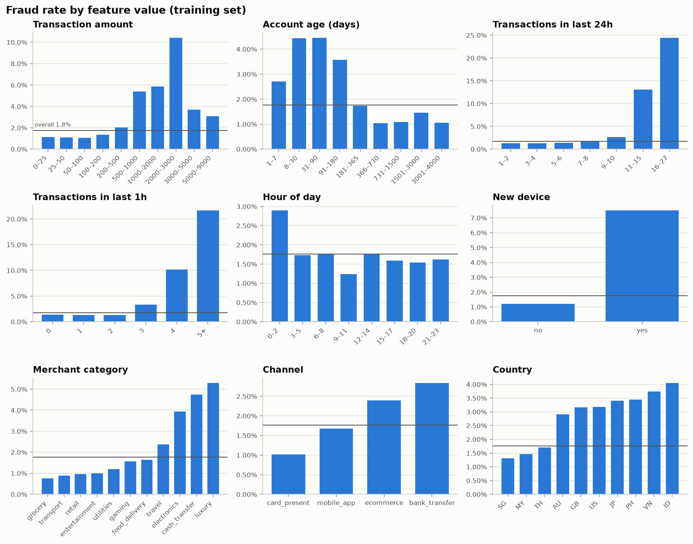
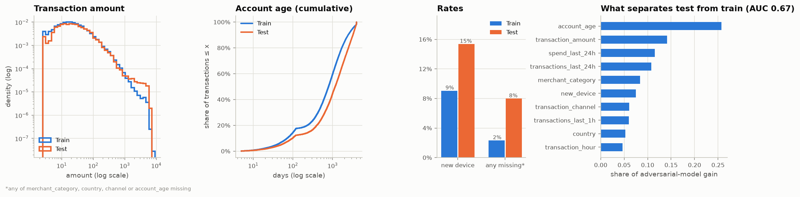
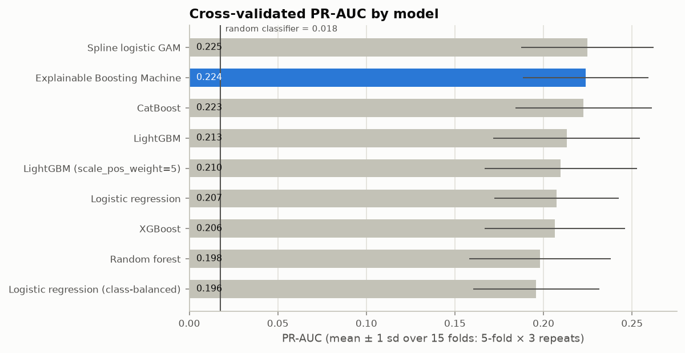
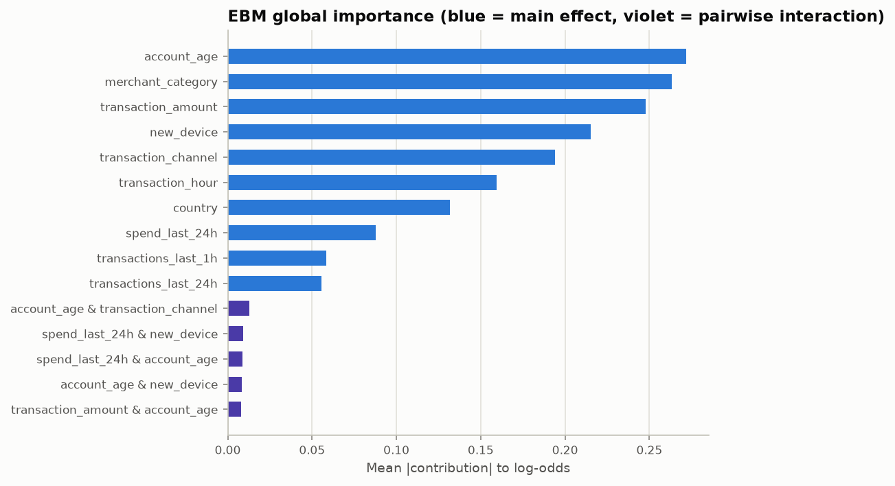
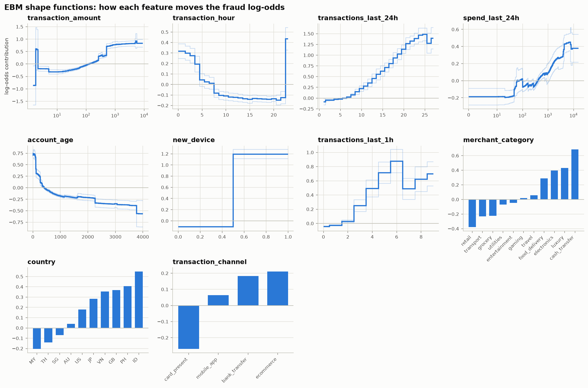
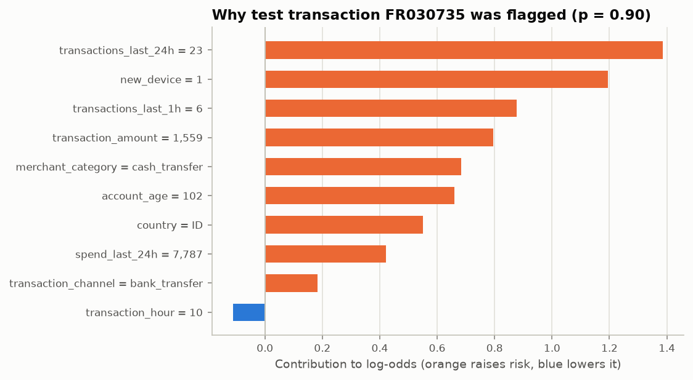
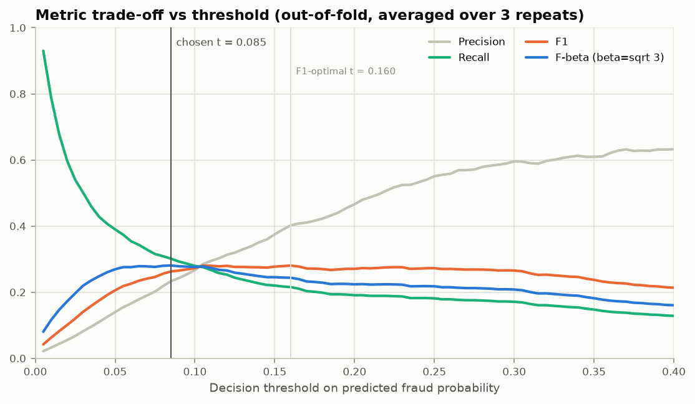
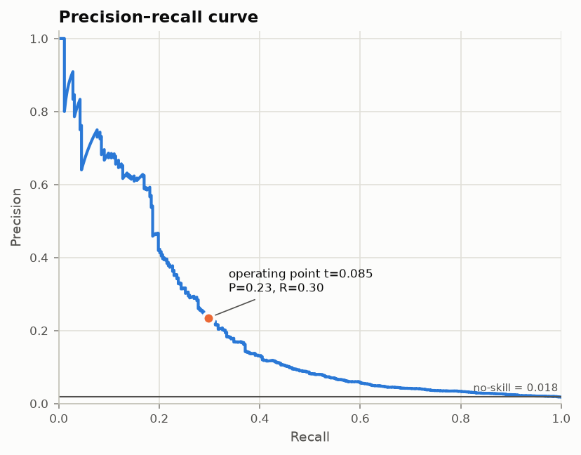
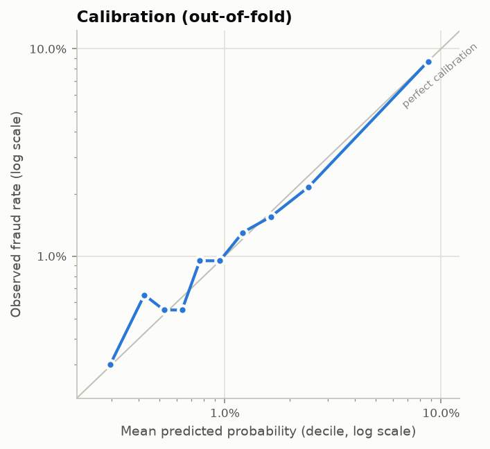

# Track 2 Fraud Detection — Model Report

## Summary

| Question | Answer |
|---|---|
| What are we predicting? | Whether a transaction is fraudulent (`fraud` = 1), for 12,000 unlabelled test transactions |
| How hard is it? | 353 frauds in 20,000 training rows (**1.77%, 1 in 57**). The signal is weak and noisy: every model family plateaus at PR-AUC ≈ 0.21–0.23 |
| Model | **Explainable Boosting Machine** (EBM), a glass-box generalised additive model with pairwise interactions (GA²M) |
| Why | Tied for best PR-AUC in a 9-model benchmark (all top models within noise), well-calibrated probabilities, robust to the train→test drift, and every prediction can be explained exactly |
| CV performance | **PR-AUC 0.224 ± 0.036** (12.7× the 0.018 no-skill baseline), ROC-AUC 0.78 |
| Decision rule | flag if *p* ≥ **0.085**: the threshold that maximises the harmonic mean of F1 and Recall (= F<sub>√3</sub>) |
| CV metrics at that rule | precision 0.23 · **recall 0.30** · **F1 0.26** · flags 2.3% of transactions |
| Test forecast (if P(fraud \| x) is unchanged) | 470 of 12,000 flagged (3.9%); expected recall ≈ 0.43, F1 ≈ 0.31 |

---

## 1. Understanding the problem

**The business problem.** A payments provider wants to stop fraudulent transactions. Each transaction must be
scored, and a cut-off decides which ones are blocked or sent for review. Two kinds of error have very different
costs:

* **False negative (missed fraud):** the full transaction value is lost, plus chargeback fees and customer harm.
* **False positive (false alarm):** an analyst reviews it, or a genuine customer is briefly inconvenienced.

Missed fraud is usually far more expensive, so the operating point should **favour recall** without letting
precision collapse. If it does, analysts drown in alerts and customers churn.

**Why the rubric's metrics are the right ones.**

* *Accuracy is meaningless here.* Predicting "not fraud" for everything scores 98.2%.
* *ROC-AUC is optimistic.* With 56 legitimate transactions per fraud, the false-positive *rate* stays small
  even when the *number* of false alarms is large.
* **PR-AUC** (average precision) summarises precision against recall across all thresholds. It ignores true negatives and
  its no-skill value equals the prevalence (0.018). It measures the **ranking** quality of the probabilities.
* **F1 and Recall** measure the **decision**: they depend on the threshold we choose. Section 7 shows that
  threshold choice moves recall from 0.10 to 0.60 for the same model. That choice is a decision the team has to make deliberately.

**Features available.**

| Group | Features |
|---|---|
| Transaction | `transaction_amount`, `transaction_hour`, `merchant_category`, `transaction_channel`, `country` |
| Account / device | `account_age` (days), `new_device` (0/1) |
| Velocity (behaviour before this transaction) | `transactions_last_1h`, `transactions_last_24h`, `spend_last_24h` |

## 2. What the data told us

### 2.1 Risk drivers



| Signal | Pattern in the training data | Fraud mechanism it suggests |
|---|---|---|
| Velocity | flat until ~10 txns/24 h or ≥3 txns/1 h, then **13–25%** fraud | card testing, rapid account draining |
| New device | **7.5% vs 1.2%**; new device on an account < 30 days old: **25%** | account takeover, synthetic accounts |
| Account age | 8–180 days ≈ 4–4.5%; > 1 year ≈ 1% | mule / freshly opened accounts |
| Amount | rises above ~$500, peaks at $2–3k (10%) | cashing out, though very large tickets are rarer |
| Merchant & channel | cash transfer / luxury / electronics (4–5%); bank transfer & e-commerce | resellable goods, card-not-present |
| Hour | 23:00–04:00 elevated | victims asleep |
| Country | most non-SG countries 2–3× SG (1.3%) | cross-border risk |

Two properties matter for model choice. First, the effects are **non-linear and step-shaped**: thresholds on
velocity and a hump in account age. A plain linear model on raw values cannot fit them. Second, the effects are mostly
**additive**: each one adds risk on its own.

### 2.2 Data quality

* **Missing values:** 0.5–0.8% per column in train and 2.0–2.4% in test, never in amount or hour. χ² tests show
  missing rows are not significantly more fraudulent, so we treat them as missing completely at random. The EBM
  gives "missing" its own bin, so no imputation is needed.
* **Caps:** `account_age` is capped at 4,000 days and `transaction_amount` at 9,000.
* **No leakage:** `spend_last_24h` is smaller than the current amount in about 20% of rows, so the velocity windows exclude the
  current transaction. They describe history available at decision time.
* No duplicate IDs, no duplicate rows, and no train/test ID overlap.

### 2.3 The test set is drawn from a shifted distribution



Fraud rate and feature distributions are flat across the 20,000 training IDs. The test set (IDs 20,001–32,000) is
a step change. A classifier trained to tell train rows from test rows reaches **AUC 0.67** (adversarial validation):

1. **A new block of large transactions.** Amounts above $1k make up 13% of test against 5% of train ($2k–6k: 9% vs 2%). They come from *old* accounts
   (median ~6 years), on *known* devices (5% new), in daytime, and mostly outside SG. Apart from the amount, these look like
   low-risk premium customers.
2. **More risk signals among ordinary-sized transactions:** new devices 17% vs 9%, and twice as many accounts
   with ≥10 transactions in 24 h.

This is a deliberate trap for models that over-trust `transaction_amount`: they would fill the alert queue with
segment 1. It also means the threshold must be set on probabilities that stay meaningful under shift. Section 8
covers that.

## 3. Evaluation design

* **Repeated stratified K-fold (5 folds × 3 repeats = 15 fits per model).** Stratification puts ~70 frauds in
  every validation fold. With so few positives a single split gives PR-AUC noise of ±0.04, larger than most
  differences between models, so we report the mean ± SD over 15 folds. All models share the **same folds**.
* **Every preprocessing step is fitted inside the fold.** Imputers, scalers, splines and encoders live in scikit-learn pipelines, so
  no validation information leaks into training.
* **Importance-weighted validation as a drift check.** Each training row is re-weighted by
  w(x) = p(test | x) / p(train | x) from the adversarial classifier, so the validation folds "look like" the test
  set. A model that only does well on the training distribution would drop on this metric.
* **The threshold is chosen on out-of-fold predictions**, never on in-sample scores.

## 4. Model selection

We compared nine models covering the main families, each with sensible regularised settings:

| Model | Family | PR-AUC (mean ± SD) | PR-AUC, test-like weighting | ROC-AUC | Best F1 | F1 / Recall at own F<sub>√3</sub> threshold | Brier |
|---|---|---|---|---|---|---|---|
| Spline logistic GAM | Hand-built GAM + domain features | 0.225 ± 0.037 | 0.337 | 0.779 | 0.287 | 0.277 / 0.298 (t=0.095) | 0.0153 |
| **Explainable Boosting Machine** | Glass-box GA2M (chosen) | 0.224 ± 0.036 | 0.339 | 0.781 | 0.288 | 0.263 / 0.301 (t=0.085) | 0.0153 |
| CatBoost | Ordered boosting, native categoricals | 0.223 ± 0.039 | 0.341 | 0.760 | 0.286 | 0.245 / 0.290 (t=0.075) | 0.0153 |
| LightGBM | Gradient boosting | 0.213 ± 0.041 | 0.333 | 0.776 | 0.287 | 0.256 / 0.307 (t=0.080) | 0.0154 |
| LightGBM (scale_pos_weight=5) | Boosting + re-weighting | 0.210 ± 0.043 | 0.319 | 0.773 | 0.279 | 0.247 / 0.315 (t=0.280) | 0.0205 |
| Logistic regression | Linear baseline | 0.207 ± 0.035 | 0.305 | 0.770 | 0.276 | 0.224 / 0.336 (t=0.065) | 0.0155 |
| XGBoost | Gradient boosting | 0.206 ± 0.040 | 0.319 | 0.761 | 0.279 | 0.231 / 0.306 (t=0.075) | 0.0154 |
| Random forest | Bagged deep trees | 0.198 ± 0.040 | 0.308 | 0.761 | 0.276 | 0.230 / 0.281 (t=0.255) | 0.0204 |
| Logistic regression (class-balanced) | Re-weighting for imbalance | 0.196 ± 0.036 | 0.281 | 0.766 | 0.270 | 0.216 / 0.314 (t=0.800) | 0.1692 |



**Findings.**

1. **No family breaks the ceiling.** Linear, spline-GAM, bagged trees, three gradient-boosting libraries and
   the EBM all fall within about one standard deviation of each other. The limit is the information in these ten
   features, not model capacity. We also tuned the EBM (interaction count, learning rate, bins, leaf size,
   bagging) and LightGBM: nothing improved beyond noise, so we kept defaults rather than overfit 353 positives.
2. **Unrestricted interactions don't help.** LightGBM, XGBoost and CatBoost can model any interaction, yet they do
   not beat additive models. This is direct evidence that the signal is additive in the log-odds, which is the core
   assumption of a GAM/EBM.
3. **Re-weighting for imbalance doesn't help.** Class-balanced logistic regression and LightGBM with
   `scale_pos_weight` score no better on PR-AUC and give inflated, uncalibrated probabilities (higher
   Brier score). PR-AUC depends only on the ranking, and re-weighting does not improve the ranking. We
   handle imbalance **at the decision threshold** instead (Section 7), which keeps the probabilities calibrated. We did not
   use SMOTE for the same reason, and because interpolating synthetic frauds in a noisy 1:56 problem risks
   inventing patterns.

## 5. Why an Explainable Boosting Machine

| Criterion | EBM |
|---|---|
| **Ranking quality (PR-AUC)** | 0.224, within 0.001 of the best model in CV and within 0.003 of the best on the drift-weighted (test-like) validation |
| **Matches the data's structure** | learns arbitrary non-linear shapes per feature plus a few pairwise interactions, which is what the EDA and benchmark showed the signal looks like |
| **Calibrated probabilities** | fitted by log-loss boosting with no re-weighting; the reliability curve sits close to the diagonal (Section 8). This makes the probability threshold meaningful |
| **Robust under drift** | shape functions are bounded step functions that extrapolate flat. The amount effect plateaus above ~$1k, so the test's new large-ticket segment is judged mostly on its (benign) account, device and time attributes |
| **Interpretable** | the prediction is exactly a sum of per-feature contributions; we can show any reviewer or regulator why a transaction was flagged. This matters for fraud teams, who must justify blocking a customer |
| **Practical** | handles missing values and categoricals natively; trains in ~6 s; scoring is a table lookup |

**Ensembling was tested and rejected.** A log-odds average of the EBM and the spline GAM (itself still an additive model)
raised PR-AUC by only +0.003, better in 10 of 15 folds (paired Wilcoxon p = 0.11), which is not significant. It would have doubled the
explanation work, with two models on different feature sets. The spline GAM alone is statistically tied with the EBM (p = 0.45). We
preferred the EBM because it learns shapes, interactions and missing-value effects automatically, without the hand-made
features and knot choices the spline model needs.

## 6. How the EBM works and what it learned

The model has the form

> logit P(fraud | x) = β₀ + Σⱼ fⱼ(xⱼ) + Σ₍ᵢ,ⱼ₎ fᵢⱼ(xᵢ, xⱼ)

* Each **shape function** fⱼ is learned by *cyclic gradient boosting*: shallow trees are fitted to **one feature at a
  time**, cycling through the features for thousands of rounds with a small learning rate (0.015) and early stopping,
  so feature order doesn't matter. This is repeated over 14 bagged subsamples and averaged, which also gives the error
  bands in the plots below.
* After the main effects are fitted, the **FAST** algorithm ranks all feature pairs by how much a pairwise term would
  reduce the residual. The strongest pairs (up to 3 × the number of features by default) get their own 2-D shape function fᵢⱼ.
* The final model is a set of lookup tables. A prediction is the intercept plus one table entry per term, passed
  through the logistic function.





**Reading the shape functions** (y-axis = change in log-odds; +0.69 doubles the odds):

* **New device** is the strongest binary signal: about +1.3 log-odds, roughly 3.6× the odds.
* **Velocity**: 24 h transaction count raises risk steadily beyond ~7 per day (up to +1.4). The 1 h count jumps at ≥3.
* **Account age**: highest for accounts under ~6 months, falling steadily with tenure.
* **Amount** rises from ~$100 to ~$1k and then **plateaus**. Raw fraud rates *drop* above $3k, but the EBM
  attributes that drop to the other features of those transactions (old accounts, daytime, known devices), not to the
  amount itself. This conditional-versus-marginal distinction is what makes the model sensible on the test set's large
  tickets.
* **Merchant / channel / country** follow the EDA: cash transfer, luxury and electronics; e-commerce and bank
  transfer; ID, PH, GB, VN and JP are risk-raising.
* **Interactions are small.** The largest, account age × channel, has under a tenth of the importance of the top main
  effect, consistent with the additivity finding.

**Explaining one decision.** Below is the highest-scored test transaction: 23 transactions in 24 h, a new device,
6 transactions in the last hour, a $1,559 cash transfer from a 102-day-old account in Indonesia. Nearly every factor
raises the risk; only the daytime hour (10:00) lowers it slightly.



## 7. Choosing the decision threshold

The rubric scores **F1 and Recall** at our chosen threshold. Their harmonic mean simplifies to a standard F-beta
score:

> HM(F1, R) = 2·F1·R / (F1 + R) = 4PR / (3P + R) = **F<sub>β</sub> with β = √3**

So we choose the threshold that maximises **F<sub>√3</sub>** on out-of-fold predictions, averaged over the three CV
repeats to smooth noise. β ≈ 1.73 weights recall about 1.7× precision. That matches the cost asymmetry in Section 1 and
gives equal emphasis to the two graded threshold metrics.



Out-of-fold metrics (mean of 3 CV repeats):

| Threshold | Precision | Recall | F1 | F<sub>√3</sub> | Share of transactions flagged | Note |
|---|---|---|---|---|---|---|
| 0.030 | 0.082 | 0.500 | 0.141 | 0.220 | 10.8% |  |
| 0.055 | 0.154 | 0.374 | 0.218 | 0.276 | 4.3% | F2-optimal |
| **0.085** | **0.233** | **0.301** | **0.263** | **0.281** | 2.3% | **chosen (F<sub>√3</sub>-optimal)** |
| 0.100 | 0.267 | 0.280 | 0.273 | 0.276 | 1.9% |  |
| 0.160 | 0.402 | 0.215 | 0.280 | 0.244 | 0.9% | F1-optimal |
| 0.300 | 0.596 | 0.171 | 0.266 | 0.208 | 0.5% |  |
| 0.500 | 0.688 | 0.098 | 0.172 | 0.125 | 0.3% | default 0.5 |

* The F1 curve is almost **flat** from t ≈ 0.08 to 0.30, while recall falls steeply. Moving from the F1-optimum
  (t = 0.16) to t = 0.085 costs 0.018 F1 and gains 0.086 recall, a 40% increase in frauds caught.
* **Theory check:** for a calibrated classifier the F<sub>β</sub>-optimal threshold is F<sub>β</sub>* / (1 + β²)
  (Lipton, Elkan & Naryanaswamy, 2014). With F<sub>√3</sub>* = 0.281 this predicts t ≈ 0.070, close to the empirical 0.085. The
  F<sub>√3</sub> curve is flat between the two (0.278 vs 0.281).
* The default threshold of 0.5 would catch only about 10% of fraud.
* `train.py --beta` makes the trade-off a single parameter if the business weighs errors differently.



## 8. Calibration and the test-set forecast



Out-of-fold probabilities are calibrated: the mean predicted probability (1.76%) matches the observed fraud rate (1.77%), and
the deciles sit close to the diagonal. For calibrated probabilities, the expected counts on an unlabelled set are E[TP] = Σ p over flagged rows,
E[FP] = Σ (1 − p) over flagged rows and E[FN] = Σ p over unflagged rows. Applied to the test set:

| Quantity (test set, t = 0.085) | Value |
|---|---|
| Model-implied fraud rate | 2.22% (train: 1.77%) |
| Transactions flagged | 470 of 12,000 (3.9%) |
| Expected precision | 0.24 |
| Expected recall | 0.43 |
| Expected F1 | 0.31 |

The model expects slightly more fraud in the test period (2.2% vs 1.8%) and better separability there, because the
drift added more clear-cut velocity and new-device cases. These numbers are only as good as the covariate-shift
assumption below.

## 9. Assumptions of the model

| # | Assumption | Why it matters | How we checked / mitigated it |
|---|---|---|---|
| 1 | **Additivity:** the log-odds are a sum of per-feature shapes plus a few pairwise interactions | the EBM cannot represent three-way effects | unrestricted GBMs (LightGBM, XGBoost, CatBoost) don't beat it; a pure-GAM EBM (no interactions) is only slightly worse |
| 2 | **Independent, identically distributed rows** | CV assumes exchangeable rows; the same customer in train and validation folds could inflate scores | no customer or card ID is provided, so we can't group folds; velocity features summarise account history; no trend across training IDs |
| 3 | **Covariate shift only:** P(x) may change but P(fraud \| x) does not | needed for probabilities, threshold and forecast to transfer to the test set | adversarial validation (AUC 0.67) quantifies the P(x) shift; importance-weighted CV shows the EBM holds up on test-like rows. P(y \| x) itself cannot be verified without test labels |
| 4 | **Calibrated probabilities** | the decision rule is a probability cut-off | reliability curve close to the diagonal; no class re-weighting used |
| 5 | **Missingness is uninformative and behaves the same in test** | the EBM learns a separate "missing" bin per feature | χ² tests not significant; the test set has 4× more missing values, which these bins absorb without imputation bias |
| 6 | **Piecewise-constant shapes with flat extrapolation** | values outside the training range get the edge bin's score | desirable here: large test amounts are not extrapolated into extreme risk |
| 7 | **Labels are correct and complete** | label noise caps achievable PR-AUC | the ≈0.22 plateau across all models suggests irreducible noise; chargeback lag could leave some frauds labelled 0 |
| 8 | **Features are known at decision time** | otherwise there is leakage | velocity windows exclude the current transaction |

## 10. Limitations and next steps

* **The signal ceiling is the binding constraint.** More model complexity won't help. Better features would:
  customer or card ID (for behavioural baselines and grouped CV), merchant ID, device fingerprint, IP-to-billing
  country mismatch, time since last transaction, and historical chargebacks.
* **Concept drift is undetectable without labels.** In production we would monitor the score distribution and
  alert rate, track per-feature PSI, and recalibrate or retrain as confirmed labels arrive. The EBM's shape plots make
  that review fast.
* **The threshold should follow real costs.** With per-transaction loss estimates, a cost-sensitive threshold
  (block if p × amount > review cost) would beat any F-score rule.
* **Variance is high.** With 353 positives the fold-to-fold SD of PR-AUC is about 0.035, so any single test-set score
  will carry similar uncertainty.

## 11. Reproducing

```bash
pip install -r requirements.txt
python train.py                      # benchmark + final model + figures + submission (~6 min)
python notebooks/build_notebook.py && jupyter nbconvert --to notebook --execute --inplace notebooks/fraud_detection.ipynb
```

All randomness is seeded (`SEED = 42` in `src/fraud_pipeline.py`).
